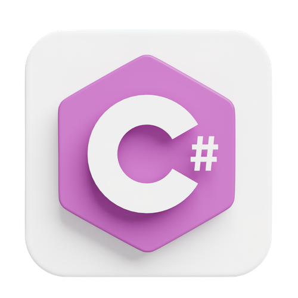

# Algorithm Assignments

Ushbu loyiha universitetda C# darslarida ko'rib chiqilgan mavzularni to'plash uchun yaratilgan. Loyihada har bir dars mavzusi sana bo'yicha alohida papkalarga ajratilgan va C# kodlarini saqlash uchun tashkil etilgan. Maqsad: dars davomida o'rganilgan bilimlarni strukturaviy holda saqlash va keyinchalik ulardan foydalanish imkonini berish yoki yoddan chiqqanda takrorlab olish.

---

## 📂 Loyihaning Tuzilishi

- **20 12 2024**: Har bir sana papkasi darsda muhokama qilingan mavzular uchun yaratiladi.
  - `DirectoryInfoMethods`: Sana papkasidagi mavzulardan biri.
  - `FileInfoMethods`: Mavzularni amaliyot bilan mustahkamlash uchun fayl bilan ishlash metodlari.
  - `papkalariQidirish`: Fayllar va papkalarni qidirish algoritmlari.

---

## 🎯 Foydalanish Maqsadi

Loyihaning asosiy maqsadi:
- Universitet darslarida ko'rib chiqilgan barcha mavzularni tartib bilan saqlash.
- Darsda o'rganilgan kod va algoritmlarni o'z ichiga olgan papkalarni xronologik ravishda tashkil etish.
- Amaliyot va mustahkamlash uchun materiallarni saqlab borish.

---

## 📝 Qo'shimcha ma'lumot

- Har bir papka faqat bitta darsga oid kodlarni o'z ichiga oladi.
- Dars mavzularini har bir sana bo'yicha izlab topish va ulardan foydalanish qulay.

---

## 👨‍💻 Yaratuvchi

**Ism:** Jasur Haydarov  
**Universitet:** Karshi State University  
**Bog'lanish:** [Gmail](mailto:jasurhaydarovcode@gmail.com)  

Agar loyiha bo'yicha savol yoki takliflaringiz bo'lsa, ushbu sahifaning tepadagi issue (taklif) qismiga yozib qoldiring yoki elektron pochtamga!
